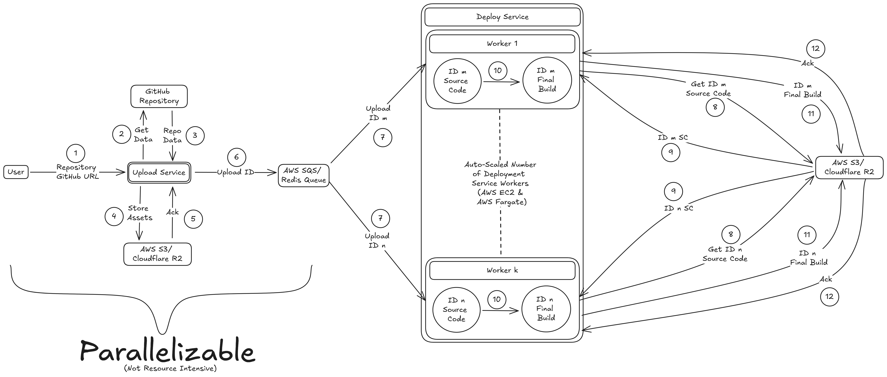
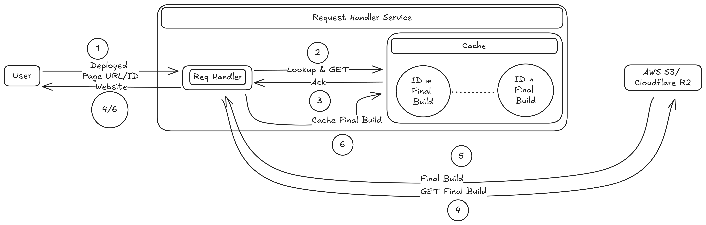

# Vercel Clone for React Projects

The project is a Vercel clone designed to offer website deployment capabilities, consisting of three primary modules:

- __Upload Feature__: Handles the uploading of files and assets necessary for deployment.
- __Deploy Feature__: Manages the deployment process, including cloning repositories, preparing build environments, and deploying the website.
- __Request Handler Feature__: Processes incoming requests, coordinating between the upload and deploy modules to ensure smooth operation.

The backend is built using `Node.js` and `TypeScript`, ensuring robust and scalable server-side functionality. The frontend is developed in `React` with `TypeScript`, providing a modern, responsive, and user-friendly interface for managing deployments. This setup offers a comprehensive solution for deploying websites efficiently.

<br>

<div align='center'>


</div>

---

## System Design
<div align=center>


Deployment Diagram


Request Handling Diagram
</div>

> Another `Redis DB` is used for checking status of a given page. (Not in diagrams) 

---

## Running the Project

### Setup

1. Clone the repository.
```
git clone https://github.com/KushShriv/Vercel-Clone-React-Projects.git
```

2. Go to each of the 4 folder and run
```
npm i
```

3. Create an AWS S3 or Cloudflare R2 bucket.

4. Make a `.env` file in the root directory of the project.
```
S3_ACCESS_KEY_ID=
S3_SECRET_ACCESS_KEY=
S3_ENDPOINT=
```
> Endpoint Not Required if you're using S3, it'll hit the right endpoint by default (Required for Cloudflare R2).

5. In `frontend/src/components/landing.tsx`, change `dev.100xdevs.com:3001` to `localhost:3001` for running locally and `your_wildcard_domain:3001`(after creating one) for production.

### Run Locally
1. Run the following commands on different terminal instances
```
node vercel-upload-service/dist/index.js

node vercel-deploy-service/dist/index.js

node vercel-request-handler/dist/index.js
```

2. In your own localhost Configuration, add `id.localhost` or `id.your_wildcard_domain:3001`, according to whatever you've done.

### Deployment
> For any large scale deployment, these services would have to be containerized first (Ex: using something like `Docker` or `Kubernetes`).

1. __Upload Service__:
    - Deploy `Upload Service` on a cloud provider (Ex: `AWS EC2`)
    - Change the `Redis` Queue and use the `AWS SQS + AWS Lambda` API to use that.

2. __Deploy Service__:
    - Deploy Upload Service using `AWS EC2 + AWS Fargate` so that it auto-scales with the size of the `SQS` queue size.

3. __Request Handler__:
    - Deploy using `AWS EKS` to deploy after `K8s` containerization.
    - Use `Amazon Global Accelerator`, `AWS Global Network` for worldwide deployment.

---

Done with the help of [Harkirat Singh's YouTube Video](https://youtu.be/c8_tafixiAs?si=9TXDrw3krv6GmIMY) 

> TODO: `// @ts-ignore;` in deploy/index.ts as the time it's returning is an object but TS implicitely thinks it's a string.